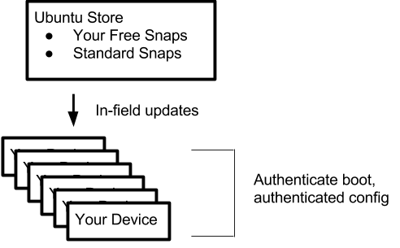

Here we provide an overview of the simple production model:

-   Your device type is one of the supported device types. See the list on the [Get started](https://developer.ubuntu.com/core/get-started) page of the developer portal.
-   Your device image consists only of snaps that are in the Ubuntu store (not in a branded store subsection)
-   Your image is made from unmodified `core`, `kernel` and `gadget` snaps
-   Your device also includes one or more extra snaps that you have published to the store as freely available (these provide the "special sauce" that makes your device unique and awesome)
-   Devices are updated in the field from the Ubuntu store (all snaps are updated as updates become available)
-   Customers can also install snaps from the Ubuntu store

This is a great choice that provides the simplest path to production.

**Note** If you want your device to connect to a branded section in the Ubuntu store, consider using the [advanced production model](advanced.md)

<h2 id="heading--steps">Steps</h2>

The high level steps are few for this production model:

1.  Develop your own *extra* snaps and publish them in the Ubuntu store as freely available
2.  Create a *model assertion* and sign it using a key you have registered with the store
3.  Create your device image (including your extra snaps) with your signed model assertion
4.  Flash your image onto your devices (the *factory* stage)
5.  Distribute your devices.

Let's take a closer look at these steps.

<h2 id="heading--develop-and-publish-your-extra-snaps">Develop and publish your extra snaps</h2>

There's no better place than [snapcraft.io](http://snapcraft.io/docs/build-snaps) for learning how to develop snaps.

Once your snap is working as expected, publish it the store as described [here](http://snapcraft.io/docs/build-snaps/publish).

Next up, you need to create your signed model assertion, then build your image.

<h2 id="heading--create-a-signed-model-assertion">Create a signed model assertion</h2>

Steps for creating a model assertion are provided [here](../build-device/image-building.html).

**Note** Your model assertion should also contain an additional key `required-snaps:` that lists your extra snaps as a JSON list of strings. These are the snaps that make your device special and help define your model.

Here's a sample model assertion file that defines a model named "my-pi3", is armhf, uses the stable (unmodified) gadget, kernel and core snaps (the unmodified core snap is assumed and has no key), contains your extra snaps ("myawesomesnap" and "mysecondawesomesnap"), and is associated with your store account ID (via the `brand-id` and `authority-id`).

    {
      "type": "model",
      "authority-id": "<your account id>",
      "brand-id": "<your account id>",
      "series": "16",
      "model": "my-pi3",
      "architecture": "armhf",
      "gadget": "pi3",
      "kernel": "pi2-kernel",
      "required-snaps": ["myawesomesnap", "mysecondawesomenape"],
      "timestamp": "<timestamp>"
    }

As noted in the other docs, you sign it with your registered key, which produces a signed model assertion file, which is used in the next step to build your image.

<h2 id="heading--build-the-image">Build the image</h2>

Steps for building an image are provided [here](../build-device/image-building.html).

**Note** While the `ubuntu-image` command provides an `extra-snaps` argument, it should not be used to install your special extra snaps, if you don't want them to be removable by the user. Extra snaps that are listed in the model assertion's `required-snaps` field are installed in the image and unremovable.

The result is an image file that you can flash onto your devices.

<h2 id="heading--factory-flash-your-devices">Factory: flash your devices</h2>

Now, flash your devices with the image file you created. One approach is to use the `dd` command to flash the image to unpartitioned and unmounted SD cards that are destined for the devices. Details here may of course vary depending on your factory process.

<h2 id="heading--distribute-your-devices">Distribute your devices</h2>

Obviously, the approach for getting your devices into customers hands in the field is up to you.

<h2 id="heading--wrap-up">Wrap up</h2>

Now that your devices are distributed in the field, they are providing unique functionality while protected by the security inherent to Ubuntu Core. Your users are getting updates (including security updates) to Canonical snaps (os, kernel, gadget) as they are published in the Ubuntu store, and you can add value by further developing your extra snaps to meet customer needs and pushing updated snaps into the store.
